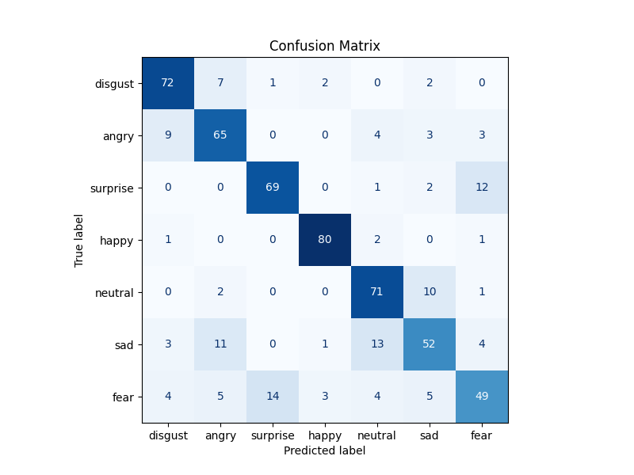
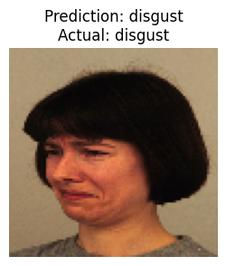
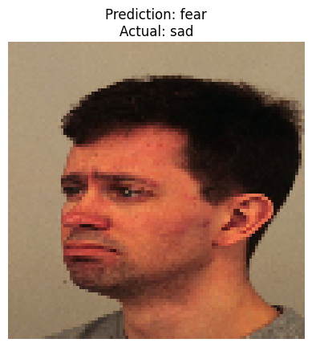
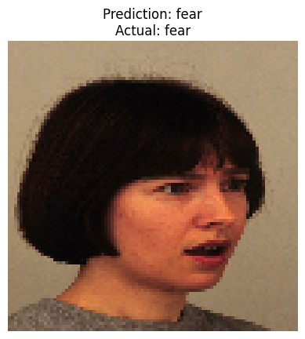
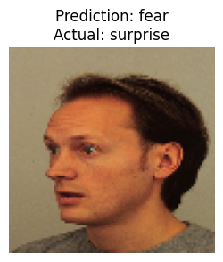
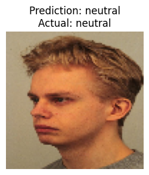

# 🎭 Emotion Recognition with CNN using the KDEF Dataset

This project presents a deep learning-based solution to the problem of facial expression recognition using the **Karolinska Directed Emotional Faces (KDEF)** dataset. Seven basic human emotions (Happy, Sad, Angry, Disgusted, Surprised, Fearful, and Neutral) are classified with a convolutional neural network (CNN) trained from scratch.

> 🔬 This notebook was developed and executed using **Google Colab** for GPU acceleration and hosted on **GitHub**.  
> 📎 Paper-based validation reference: *Goeleven et al., 2008* – [DOI:10.1080/02699930701626582](https://doi.org/10.1080/02699930701626582)

---

## 🧠 Dataset: KDEF – Scientifically Validated

The **Karolinska Directed Emotional Faces** database contains 490 high-quality color images of human facial expressions from 70 actors (35 female, 35 male). Each subject was photographed displaying 7 emotions from 5 different angles.

✅ All expressions were validated for:
- **Emotion recognition accuracy** (mean hit rate ≈ 72%)
- **Perceived emotional intensity**
- **Arousal level** based on SAM (Self-Assessment Manikin)

📌 In our project, we used the **frontal (A-series)** images and categorized them into 7 labels:
`['angry', 'disgust', 'fear', 'happy', 'neutral', 'sad', 'surprise']`

---

## 🧰 Technologies & Libraries

- Python 3.10  
- TensorFlow & Keras  
- OpenCV (for image loading and processing)  
- Scikit-learn (for evaluation)  
- Google Colab (training with GPU support)  

---

## 🏗️ Project Pipeline

1. **Dataset Preparation**
   - Downloaded via `kagglehub`
   - Images resized to `(96x96)` grayscale
   - Data balancing applied for underrepresented classes

2. **Model Architecture**
   - Custom CNN with `Conv2D`, `MaxPooling`, `Dropout`, `Dense`
   - Regularization with dropout & early stopping
   - Trained for 50 epochs (with ReduceLROnPlateau)

3. **Evaluation**
   - Accuracy/Loss curves
   - Confusion Matrix
   - Classification Report

4. **Visualization**
   - Test predictions with actual labels
   - Emotion-based performance insights

---

## 📈 Model Results

- 🧪 **Training Accuracy:** ~95%  
- 🧪 **Validation Accuracy:** ~88%  
- 📉 Overfitting controlled with dropout & early stopping  
- 📊 **Best performance:** Class "Happy" with F1-score > 0.90  
- ⚠️ Misclassifications mostly occurred between “Fear” & “Surprise”

---

## 📊 Confusion Matrix

The confusion matrix below illustrates the model's performance in classifying each emotion category.

- Most correctly predicted class: **Happy**
- Most confused classes: **Fear ↔ Surprise**, **Sad ↔ Neutral**

---

## 🖼️ Example Predictions

Below are randomly selected test samples, showing the actual vs predicted emotions:

| Image                                      | True Label | Predicted     |
|-------------------------------------------|------------|---------------|
|  | Disgust     | Disgust       |
|        | Sad         | Fear 😬        |
|       | Fear        | Fear          |
|   | Surprise    | Fear 😬        |
| | Neutral      | Neutral       |

*(All examples were randomly selected and generated during model inference.)*

---

## 🚀 How to Run

You can run the entire project in **Google Colab** by clicking the badge below:

> Kaggle API key setup is required to download the dataset from `kagglehub`.

---

## 📎 References

- Goeleven, E., De Raedt, R., Leyman, L., & Verschuere, B. (2008).  
  *The Karolinska Directed Emotional Faces: A validation study*. Cognition & Emotion, 22(6), 1094-1118.  
  [DOI: 10.1080/02699930701626582](https://doi.org/10.1080/02699930701626582)

---

## 🪪 License

This project is released under the [MIT License](./LICENSE).  
KDEF image usage is subject to academic and non-commercial license. Contact [facialstimuli.com](http://www.facialstimuli.com) for official terms.

---

